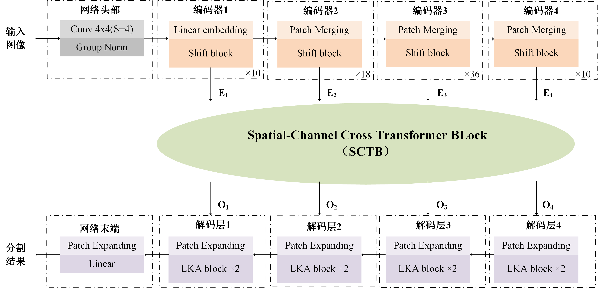
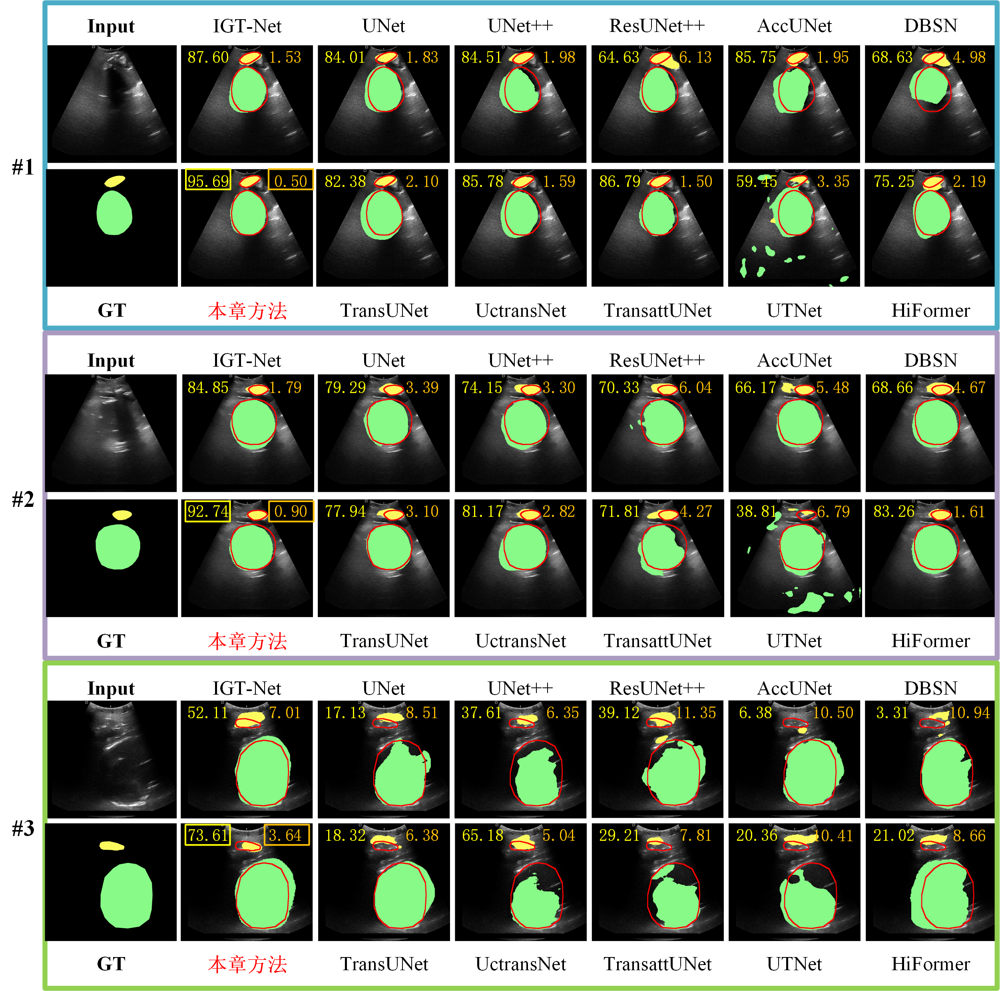

# S2L-Vit: A Novel Approach to Improve Small Object Segmentation in Intrapartum Ultrasound

Official pytorch code for "S2L-Vit: A Novel Approach to Improve Small Object Segmentation in Intrapartum Ultrasound"

- [x] Code release
- [ ] Paper release

## Abstract
This paper explores the S2L-Vit network for small object segmentation, incorporating a Large Kernel Attention (LKA) decoder 
and Spatial Channel-Token Bridge (SCTB) skip connections into ShiftVit. The SCTB effectively models channel and spatial 
interactions, allowing for precise localization of small targets, while the LKA decoder uses large kernel convolutions 
for image resolution recovery, enhancing segmentation accuracy. The experimental results demonstrate the superiority of 
this approach, with performance metrics indicating JS of 89.50%±0.47%, DicePS of 88.47%±0.73%, DiceFH of 94.97%±0.17%, 
DiceAll of 94.94%±0.35%, ASDPS of 1.49±0.17, ASDFH of 2.13±0.09, and ASDAll of 1.95±0.08. These outcomes surpass other 
state-of-the-art models, confirming S2L-Vit's advantage in obstetric ultrasound imaging for small object segmentation. 
In generalization tests, S2L-Vit showed excellent performance across different datasets and scenarios, indicating its 
potential for broader clinical application in obstetrics. Overall, the chapter establishes that S2L-Vit delivers significant 
improvements in accuracy and maintains high performance stability.

### S2L-Vit:

## Performance Comparison

## Environment

- GPU: NVIDIA GeForce RTX3090 GPU
- Pytorch: 1.10.0 cuda 11.4
- cudatoolkit: 11.3.1

